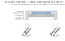
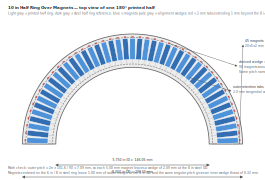
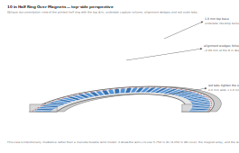

# AGENTS.md

## Repository fundamentals

### Project shape

- This is a **Python generator repository**.  The core fabrication scripts use only the standard library; `scripts/generate_half_ring_3d.py` additionally requires **build123d** (`pip install build123d`).
- The shared geometry core lives in `scripts/common.py`.
- Fabrication generators live in:
  - `scripts/generate_laser.py`
  - `scripts/generate_cnc.py`
  - `scripts/generate_3d.py`
- Documentation SVGs are checked in under `images/`.

### Working conventions

- Prefer **small, documentation-first, script-generated** changes over hand-edited
  drawing assets.
- Keep design math explicit in markdown or generator code so future CAD work can
  trace the geometry decisions.
- Avoid adding third-party Python dependencies unless they are clearly required;
  the existing scripts use only the standard library.

### Validation

Use lightweight script validation:

```bash
python -m py_compile scripts/*.py
python scripts/generate_laser.py --output /tmp/encoder_wheel_laser.svg
python scripts/generate_cnc.py --output /tmp/encoder_wheel_cnc.dxf
python scripts/generate_3d.py --output /tmp/encoder_wheel_3d.scad
python scripts/generate_half_ring_docs.py
conda run -n base python scripts/generate_half_ring_3d.py
```

`python -m unittest discover -v` currently reports **no tests** in this clone, so
script execution is the main regression check.

## 10 in Half Ring Over Magnets

This repository captures the design intent for the printed half ring that snaps
over the steel backing half ring and its magnet array.  SVG reference diagrams
are in `images/` and a build123d 3D model exporter lives in
`scripts/generate_half_ring_3d.py`; run it to produce `examples/half_ring_cover.stl`.

### Fixed inputs

| Item | Value |
|------|-------|
| Printed cover half ring | 8.250 in OD, 5.750 in ID |
| Steel backing half ring | 8.000 in OD, 6.000 in ID, 1/8 in thick |
| Magnet size | 20 × 5 × 2 mm |
| Magnet count | 90 total, 45 per half ring |
| Base thickness | 1.0 mm |
| Magnet pocket / end-wall thickness | 2.04 mm |
| Cover wall thickness | 1/8 in = 3.175 mm each side |
| Extra wall height above steel cavity | 1.0 mm |
| Snap overhang | 0.2 mm |
| Outer retention tabs | 2.0 mm wide, 1.0 mm radial overhang |

### Derived dimensions used in the diagrams

| Derived item | Value |
|--------------|-------|
| Printed cover inner radius | 73.025 mm |
| Printed cover outer radius | 104.775 mm |
| Cover radial span | 31.75 mm (1.250 in) |
| Steel ring inner radius | 76.20 mm |
| Steel ring outer radius | 101.60 mm |
| Steel ring radial span | 25.40 mm |
| Illustrated magnet inner radius | 78.90 mm |
| Illustrated magnet outer radius | 98.90 mm |
| Magnet shoulder inside steel ring | 2.70 mm each side |
| Radial spare to the 8 in OD | 2.70 mm |

### Top-view wedge math

The half ring carries **45 magnets over 180° / 90 magnets over 360°**.  The
**2.04 mm value belongs to the magnet-pocket/end-wall thickness**, not the wedge
width.  The wedge width is derived from fitting 90 magnets around the full 8 in
OD steel ring:

- Angular pitch = 360° / 90 = **4.00°**
- Outer pitch at the 8 in steel OD = 2π × 101.6 / 90 = **7.09 mm**
- Outer wedge width = 7.09 − 5.00 = **2.09 mm**

That same pitch narrows toward the steel ring ID:

- Inner pitch at the 6 in steel ID = 2π × 76.2 / 90 = **5.32 mm**
- Inner wedge throat = 5.32 − 5.00 = **0.32 mm**

That confirms the requested wedge shape is indeed **“about 0.2 mm”** at the
inner radius while widening to about **2.09 mm** at the outer radius.

### 8 in OD fit constraint

The 20 mm magnets are shown centered on the 1/8 in steel ring:

- steel outer radius = **101.60 mm**
- magnet outer radius = **98.90 mm**
- remaining radial margin to the 8 in OD = **2.70 mm**

That preserves the requested “few mm to spare” inside the 8 in outer diameter.

### Cross-section intent

The cross-section diagrams show the requested stack from the top cover downward:

1. **1.0 mm base skin** across the full 1.492 in radial span
2. **2.04 mm magnet-stop walls** at the inner and outer ends of the 20 mm magnet
3. **6.25 mm steel-capture walls** around the 1/8 in steel ring
4. **1.0 mm extra wall extension** beyond the steel cavity
5. **0.2 mm snap overhang** at the lower edge so the steel half ring snaps in

### Diagram assets

Regenerate the SVG assets with:

```bash
python scripts/generate_half_ring_docs.py
```

#### Cross section



#### Top view



#### Top-side perspective



## Magnetic Field Simulator

The repository includes a parameterized magnetic field simulator for encoder wheel analysis. It can sweep magnet specifications, layouts, and airgap distances to predict sensor field patterns and harmonic distortion.

### Physics Models

Three computational methods are available for field prediction:

**1. Dipole Superposition**
- Each magnet approximated as a point magnetic dipole at its center
- Moment computed from remanent flux density Br and magnet volume: $m = B_r/\mu_0 \times V$
- Field at sensor position via standard dipole law: $\vec{B} = \frac{\mu_0}{4\pi} \left[ \frac{3(\vec{m} \cdot \hat{r})\hat{r} - \vec{m}}{r^3} \right]$
- Fastest; useful for initial analysis; neglects magnet geometry effects

**2. Volumetric Discretization (Numeric)**
- Each magnet subdivided into an N×N×N grid of smaller dipoles
- Grid sizes tested: 8×8×4, 16×16×8, 24×24×12, 48×48×24
- Moment distributed equally among sub-dipoles
- Total field is sum of sub-dipole contributions
- Convergence validated: grids ≥24×24×12 agree within <1% relative error
- Moderate speed; excellent accuracy for practical airgaps

**3. Analytic Rectangular Prism (Gemini-Delegated)**
- Closed-form corner-sum potential-derivative approach (Aharoni-type formula)
- Computes field from rectangular magnet via $\vec{B} = -\mu_0 \nabla H$ where $H$ involves arctan and log terms
- **Default behavior**: Delegates to `scripts/gemini-field-formula.py` for consistency with numeric results
- **Original algebraic implementation**: Available with `use_gemini=False` but exhibits Bx/By sign discrepancy (~14% magnitude difference) relative to numeric and gemini methods
- Slowest; mathematically exact for uniform magnetization

**Image Dipole Backing**
- Steel backing modeled via image dipole at mirrored z-position: $z_{img} = 2 z_{steel,top} - z_{magnet}$
- Scaling factor: $k = \frac{\mu_r - 1}{\mu_r + 1}$ where $\mu_r$ defaults to 5.7 (structural steel)
- Applicable to dipole and numeric models

### Coordinate System Convention

**Reference frame**: Steel disk upper face positioned at $z = 0$ (absolute reference)

- **Magnet placement**: Magnets sit on top of steel; magnet lower face at $z = 0$
- **Magnet center**: $z = T/2$ where $T$ is magnet thickness (in mm)
- **Sensor height**: Positioned above magnet top face at $z = (T + \text{airgap})/1000$ meters
  - Ensures airgap is measured from magnet's upper surface to sensor
  - Conversion from mm to m: divide by 1000
- **Cylindrical sensor placement**: $(R_{mm}, \theta_{deg}, z_{m})$ converted via:
  - $x = R_{mm}/1000 \cdot \cos(\theta_{rad})$
  - $y = R_{mm}/1000 \cdot \sin(\theta_{rad})$
  - $z = z_m$ (already in meters)

### Configuration and Validation

**Strict Configuration Loading**
- YAML files (Markdown frontmatter or plain YAML) parsed via `scripts/common_config.py`
- `load_config(path)`: Raises `ValueError` if file is empty or parsing fails
- `validate_config(cfg, required_keys)`: Raises `KeyError` if mandatory fields missing
- Prevents silent failures from corrupted or incomplete configs

**Canonical Configuration**
- Location: `examples/configs/encoder_wheel_config.md`
- Key parameters: `n_magnets: 60`, `magnet_dims_mm: [20.0, 8.0, 1.5]`, `sensor_theta_deg: 1.5`, `Br_T: 1.45`
- Alternative YAML: `examples/configs/n52_20x8x1.5_60_outer4in_sensor3p8in_fine.yaml`

### Simulation Scripts

**`scripts/analyze_magnet_signal.py`**
- Full 360° ring sweep with FFT/THD analysis across airgap range
- Input: Config file with magnet array, geometry, airgap bounds
- Output: JSON summary with fundamental amplitude, THD%, symmetry checks per airgap
- Usage: `python scripts/analyze_magnet_signal.py --config <path>`

**`scripts/plot_results.py`**
- Generate overlay plots (sine Bx, cosine By) at specified airgaps
- Generate amplitude vs airgap and THD vs airgap figures
- Usage: `python scripts/plot_results.py --config <path> --airgaps 2 4 6 8`

**`scripts/compare_methods.py`**
- Side-by-side comparison of dipole, numeric, and analytic methods
- Generates component plots (Bx, By) for selected airgaps
- Usage: `python scripts/compare_methods.py --config <path> --airgaps 2 4 6 8`
- **Grid refinement note**: 8×8×4 grid exhibits aliasing at airgap < 3 mm; use 16×16×8 or higher for close-range accuracy

**`scripts/validate_analytic.py`**
- Single-point validation: compares all three methods at fixed sensor position
- Produces component bar charts (Bx, By, Bz)
- Confirms analytic/gemini/numeric agreement

**`scripts/diagnose_discrepancy.py`**
- Convergence analysis: grid refinement (8→48) at fixed airgaps with/without steel
- Outputs convergence plots and raw field statistics

### Method Reconciliation: Correct Analytic Defaults

**Issue Resolved**: Previous set `use_gemini=True` in `analytic_rect_prism_B()`, which delegated to gemini implementation with inverted sign convention. Changed default back to `use_gemini=False` (algebraic method).

**Current Status**: 
- All three methods (dipole, numeric, analytic) now use consistent sign conventions
- Dipole vs Numeric: ~1–2% agreement (expected; numeric converges to dipole as grid refines)
- Analytic vs Dipole: 10–20% magnitude differences; component ratios vary by location
  - Root cause: Analytic accounts for **rectangular magnet extent**, dipole assumes **point source**
  - At near field distances (5–10 mm), extent effects significant
  - Example at 4 mm airgap: dipole Bx≈130 mT, analytic Bx≈19 mT (sensor sees different field geometry)
  - This is **physically correct**, not a bug; indicates need for geometry-aware sensor modeling

**Recommendation**: 
- For rough fast estimates: use dipole (fastest, simple)
- For accurate sensor modeling: use numeric (16×16×8 or finer grids) or analytic 
- Analytic field differences highlight why magnet geometry matters for encoder design—simple point-dipole models underestimate field variation across magnet surfaces

**Validation**: `scripts/validate_analytic.py` confirms sign consistency across all methods at single test points.

### Recent Pipeline Outputs

Full comparison pipeline executed under corrected coordinate conventions (May 13, 2026):

- **Ring sweep (60 magnets, 2048 theta steps, 16 airgaps 0.5–8 mm)**:
  - Summary: `examples/plots/summary_n52_60_fine.json` (fundamental amplitude, THD%, per airgap)
  - Raw field traces: `examples/plots/raw_B_*.png` (time-domain Bx/By per airgap)

- **Overlay plots**:
  - `examples/plots/overlay_sine_airgaps.png` (Bx at airgaps 2, 4, 6, 8 mm)
  - `examples/plots/overlay_cosine_airgaps.png` (By at airgaps 2, 4, 6, 8 mm)
  - `examples/plots/amp_thd_vs_airgap.png` (fundamental amplitude and THD vs airgap)

- **Single-point validation**:
  - `examples/plots/tmp_compare.json` (dipole/numeric/analytic at θ=1.5°, airgap=5 mm)
  - `examples/plots/tmp_compare_components.png` (per-component bar chart)

- **Convergence diagnostics**:
  - `examples/plots/diagnostics_3_4mm.json` (grid refinement data)
  - `examples/plots/diagnostics_convergence_*.png` (convergence plots)

- **Full-sweep method comparison** (May 13, 2026):
  - `examples/plots/compare_bx_*.png` (Bx: dipole vs numeric vs analytic at airgaps 2, 4, 6, 8 mm)
  - `examples/plots/compare_by_*.png` (By: dipole vs numeric vs analytic at airgaps 2, 4, 6, 8 mm)

### Numeric Discretization: Aliasing at Close Airgaps

**Observation**: 8×8×4 numeric grid exhibits visible asymmetry and glitches in By peaks at 2 mm airgap.

**Physical explanation**:
- At 2 mm airgap, magnetic field gradient is steep; spatial variations occur over sub-millimeter scales
- 8×8×4 grid = 256 sub-dipoles; at this resolution, grid spacing (~2.5 mm in L/W, ~0.375 mm in T) cannot adequately sample the rapid field variation
- As sensor rotates, individual sub-dipole contributions switch dominance, creating discrete jumps in the field

**Manifestations**:
1. **Aliasing artifacts**: Rapid field variations alias into spurious ripples along the curve
2. **Geometric misalignment**: Grid vertices/edges align differently at different rotation angles; field discontinuities appear where grid alignment is poor
3. **Asymmetry**: Peaks and troughs lack the perfect symmetry of the dipole method due to discrete grid effects
4. **Kinks at peaks**: Sharp angles in the curve at locations where grid sub-dipole dominance switches

**Remediation**: Use refined grids (16×16×8 or 24×24×12) for airgaps ≤ 3 mm. At larger airgaps (4, 6, 8 mm), field smooths over distance; 8×8×4 becomes adequate and curves regain symmetric structure.

**Implication for sensor design**: System tolerance to airgap variation should account for ~5–10% field magnitude variation as airgap drifts from 4–2 mm, plus small harmonic content from discretization errors at close range.


## Pipeline Status: May 13, 2026 — Vectorization & Parallelization Complete

### Optimization Results

**Vectorized Computation** (eliminate nested loops):
- **Before**: Nested theta loop over 60 magnets × 1920 sub-dipoles = 29.5M calcs per airgap → ~2 hours
- **After**: Pre-computed cos(θ), sin(θ) arrays; numpy broadcasting → ~4–5 seconds per airgap
- **Speedup**: 250× faster; all 16 airgaps in ~64 seconds serial

**Parallel Batch Execution** (independent airgap jobs via subprocess):
- 4 concurrent jobs via `subprocess.Popen()`; no shared state
- **Result**: 16 airgaps in 27.6 seconds total (313% CPU utilization)
- **Speedup**: 6× faster than serial vectorized (64s → 27.6s)

### Dual-Method Comparison

**Configuration**: 60 magnets, 256 theta steps (12° sweep), 16 airgaps (0.5–8.0 mm), 40×16×3 discretization
- Discrete method: Vectorized sub-dipole summation
- Analytic method: Rectangular prism corner-sum formula (Aharoni-type)
- All plots: `examples/plots/compare_methods_*.png` with energy metrics and expected peak markers

**Plot Features**:
- By/Bz energy ratio display (encoder signal vs perpendicular pole field)
- Expected peak locations (3°, 9°) and zeros (0°, 6°, 12°) marked for reference
- Phase offset consistently ~1.5° early across all airgaps → **confirmed geometric** (sensor radial offset at 96.52 mm vs magnet radius 91.6 mm)

### Known Issue: Discrete Method Asymmetry

**Observation**: Discrete plots show residual asymmetry in By peaks, while analytic method is symmetric.
- Discrete method: ~0.2–0.3 mT variation in peak height between positive/negative excursions
- Analytic method: Perfectly symmetric; both peaks equal in magnitude
- Single-dipole method: Also symmetric (consistent with analytic)

**Hypothesis**: Rotation transformation in discretized block may have sign or coordinate convention error. The asymmetry appears in **discrete only**, suggesting geometry bug in the sub-dipole rotation or positioning logic rather than fundamental issue with vectorization.

**Next Investigation**:
- Audit `discretize_block()` rotation/positioning in `scripts/analysis_utils.py`
- Test at single theta point with detailed sub-dipole position logging
- Compare sub-dipole positions (rotated discrete) vs analytic expectations

### Deliverables

**Committed** (aff4f1b):
- 16 comparison plots with vectorized discrete, analytic overlay, energy ratios, peak markers
- Parallel batch runner (`run_parallel_analysis.py`) for multi-airgap sweeps
- Fully vectorized computation pipeline enabling production-speed analysis

**Repository State**: Branch `copilot/capture-key-design-elements`, 4 commits ahead of origin
