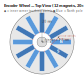
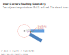

# Encoder Wheel

A parametric design repository for **magnetic rotary encoder wheels**.

The wheel holds *N* (a multiple of 12) rectangular permanent magnets in a
radial arrangement.  A Hall-effect sensor reads the alternating North/South
poles as the wheel rotates, giving a high-resolution angle or speed signal.

This repository provides Python scripts that generate ready-to-fabricate files
for three different manufacturing processes:

| Fabrication method | Script | Output format |
|--------------------|--------|---------------|
| **Laser cutter** | `scripts/generate_laser.py` | SVG |
| **CNC mill** | `scripts/generate_cnc.py` | DXF (R12) |
| **3-D printer** | `scripts/generate_3d.py` | OpenSCAD (`.scad`) |

All scripts share a common geometry core (`scripts/common.py`) and accept the
same magnet-dimension and pole-count parameters, so you can swap fabrication
methods without re-calculating anything.

---

## Contents

```
encoder-wheel/
├── scripts/
│   ├── common.py           shared geometry calculations
│   ├── generate_laser.py   → SVG for laser cutting
│   ├── generate_cnc.py     → DXF for CNC milling
│   ├── generate_3d.py      → OpenSCAD for 3-D printing
│   └── generate_multipart_ring.py → OpenSCAD multipart bell/gudgeon ring
├── examples/
│   ├── encoder_wheel_12pole_laser.svg
│   ├── encoder_wheel_24pole_laser.svg
│   ├── encoder_wheel_108pole_laser.svg
│   ├── encoder_wheel_12pole_cnc.dxf
│   ├── encoder_wheel_108pole_cnc.dxf
│   ├── encoder_wheel_12pole_3d.scad        (back plate + tabs)
│   ├── encoder_wheel_108pole_3d.scad       (back plate + tabs)
│   ├── encoder_wheel_12pole_3d_frontface.scad
│   └── encoder_wheel_12pole_3d_steelclip.scad
└── images/
    ├── top_view.svg
    ├── cross_section.svg
    └── geometry.svg
designs/
├── primary_half_ring.md
├── secondary_half_ring.md
└── u_mount_plate.md
```

---

## Design Overview

### Magnet arrangement

Each magnet is a rectangular block:

```
  magnet_length  (L)  — radial extent    (default 20 mm)
  magnet_width   (w)  — tangential extent (default  5 mm)
  magnet_thickness(t) — axial extent     (default  2 mm)
```

The magnets are placed radially around a central axis.  Their 5 mm
(tangential) faces point around the wheel; their 20 mm (radial) faces point
outward from the centre.



*Alternating blue shades represent North (lighter) and South (darker) poles.
Red dots mark the **touching inner corners**.*

### The inner-corners-touching condition

A key design constraint is that **the inner corner of each magnet meets the
inner corner of the adjacent magnet**.  This means:

- There is zero gap between adjacent magnets at the inner radius.
- The inner rim is structurally disconnected from the outer ring — the only
  structural connection between the outer ring and the inner area is through
  the triangular "spokes" between adjacent magnet slots.



The minimum inner radius is derived by requiring the inner-CW corner of magnet
*i* to be the same Cartesian point as the inner-CCW corner of magnet *i+1*:

```
r_inner_min = (w / 2) / tan(π / N)
```

| N (poles) | r\_inner\_min | r\_outer (r\_inner + 20 mm) | Disc ⌀ (+3 mm margin) |
|-----------|---------------|-----------------------------|------------------------|
| 12        | 9.33 mm       | 29.33 mm                    | 64.7 mm                |
| 24        | 18.99 mm      | 38.99 mm                    | 84.0 mm                |
| 36        | 28.69 mm      | 48.69 mm                    | 103.4 mm               |
| 48        | 38.41 mm      | 58.41 mm                    | 122.8 mm               |
| 108       | 85.92 mm      | 105.92 mm                   | 217.8 mm               |

You can specify a larger `--inner-radius` to increase the disc size (e.g., to
fit a specific shaft hub), but you cannot go smaller than `r_inner_min`.

---

## Quick Start

No external Python packages are required — the scripts use only the standard
library.

```bash
# Laser cutter SVG (12 poles, default parameters)
python scripts/generate_laser.py --output my_wheel.svg

# CNC milling DXF
python scripts/generate_cnc.py --output my_wheel.dxf

# 3-D printing OpenSCAD (with retaining tabs and back plate)
python scripts/generate_3d.py --output my_wheel.scad

# Multipart bell/gudgeon ring (90 magnets, 6"/8" steel backing defaults)
python scripts/generate_multipart_ring.py --output multipart_encoder_ring.scad
```

Open the resulting files in your favourite CAD / laser / slicer tool.

---

## Parameters

All three scripts accept the following common parameters:

| Flag | Default | Description |
|------|---------|-------------|
| `--n-magnets N` | `12` | Number of magnets (must be a multiple of 12) |
| `--length L` | `20.0` | Magnet radial length (mm) |
| `--width W` | `5.0` | Magnet tangential width (mm) |
| `--thickness T` | `2.0` | Magnet axial thickness (mm) |
| `--inner-radius R` | *(minimum)* | Inner radius (mm); computed if omitted |
| `--margin M` | `3.0` | Extra material beyond the outer magnet tips (mm) |
| `--center-bore R` | `5.0` | Central shaft bore radius (mm) |

### Laser cutter (`generate_laser.py`)

| Flag | Default | Description |
|------|---------|-------------|
| `--kerf K` | `0.1` | Kerf compensation per side (mm) — expands each slot |
| `--no-center-hole` | — | Omit the central shaft hole |
| `--center-hole-radius R` | `5.0` | Shaft hole radius (mm) |

**Sheet thickness** should match `--thickness` (the magnet axial dimension).
Use 2 mm acrylic or plywood.

The SVG uses two colours:
- **Red** (`#FF0000`) — through-cut paths
- **Blue** (`#0000FF`, dashed) — score / engrave lines

### CNC mill (`generate_cnc.py`)

| Flag | Default | Description |
|------|---------|-------------|
| `--clearance C` | `0.1` | Per-side pocket clearance for easy fit (mm) |

The DXF output contains four layers:

| Layer | Description |
|-------|-------------|
| `BOUNDARY` | Outer disc circle — profile cut |
| `BORE` | Central shaft bore — profile cut or drill |
| `POCKETS` | Magnet pocket rectangles — machine as pockets to `--thickness` depth |
| `REFERENCE` | Inner radius circle — do not cut, reference only |

Machine the `POCKETS` first, then `BORE`, then `BOUNDARY`.

### 3-D printer (`generate_3d.py`)

The 3-D printing script has several additional options for the wheel frame
construction:


#### Retaining tabs (`--tabs` / `--no-tabs`, default: on)

Small overhanging lips at the inner- and outer-radial ends of each pocket
opening.  They overhang the pocket by `--tab-overhang` mm so that a magnet
snapped in from above is held without adhesive.

| Flag | Default | Description |
|------|---------|-------------|
| `--tabs` | *(on)* | Add retaining-tab overhangs |
| `--no-tabs` | — | Omit retaining tabs (glue or press-fit magnets) |
| `--tab-width W` | `1.5` | Radial width of each tab (mm) |
| `--tab-overhang D` | `0.6` | Overhang depth of each tab into pocket (mm) |

> **Tip**: Print with the pocket face upward.  The tabs are short bridging
> spans that FDM printers handle without support.

#### Back plate (`--back-plate` / `--no-back-plate`, default: on)

A solid printed disc behind the magnet pockets seals the back face.

| Flag | Default | Description |
|------|---------|-------------|
| `--back-plate` | *(on)* | Include a printed back disc |
| `--no-back-plate` | — | Open back face (magnets accessible from both sides) |
| `--back-thickness T` | `1.5` | Back plate thickness (mm) |

#### Smooth front face (`--front-face` / `--no-front-face`, default: off)

A thin solid skin covers the front (sensor-facing) side of the wheel.

| Flag | Default | Description |
|------|---------|-------------|
| `--front-face` | — | Add a smooth front face over the magnets |
| `--no-front-face` | *(on)* | Leave front face open |
| `--front-thickness T` | `0.8` | Front face thickness (mm) |

> Use `--front-face` when you want a smooth, consistent air-gap distance to
> your Hall-effect sensor array.

#### Steel backing-plate clips (`--steel-clip` / `--no-steel-clip`, default: off)

Adds rectangular notch features around the outer rim so that a separate thin
**steel disc** can snap into the frame from the back.  The steel disc acts as a
**magnetic flux-return** path, concentrating the field toward the sensor face
and significantly improving signal strength.

| Flag | Default | Description |
|------|---------|-------------|
| `--steel-clip` | — | Add steel-plate clip slots in the outer rim |
| `--no-steel-clip` | *(on)* | No clip slots |
| `--n-clips N` | `6` | Number of clip slots (evenly spaced) |
| `--clip-width W` | `3.0` | Clip slot width (mm) |
| `--clip-depth D` | `1.2` | Clip slot radial depth (mm) |
| `--clip-height H` | `1.0` | Clip slot axial height (mm) |

Use `--steel-clip --no-back-plate` to leave the back fully open for the steel
disc.  Cut or stamp the steel disc to the same outer diameter as the frame.

---

## Fabrication Notes

### Laser cutting

1. Set your material to a sheet whose thickness matches the magnet axial
   dimension (typically 2 mm acrylic).
2. Import the SVG into your laser software.  The file dimensions are in mm.
3. Assign the **red** lines as *cut* and the **blue** dashed lines as *engrave*
   (or simply ignore blue if you do not want the reference markings).
4. After cutting, slide the magnets into the slots, alternating N/S poles.
   A thin drop of super-glue holds each magnet in place.

### CNC milling

1. Open the DXF in your CAM software (Fusion 360, Mastercam, Vectric, etc.).
2. Machine the **POCKETS** layer as 2-D pockets to `--thickness` depth.
3. Drill or bore the **BORE** layer as a hole through the full material
   thickness.
4. Profile-cut the **BOUNDARY** circle last, with tabs to keep the disc in
   the fixture.
5. Suitable materials: aluminium, brass, Delrin/POM, HDPE, or steel.
   For best magnetic signal, use **non-magnetic** material (aluminium,
   brass, plastic).

### 3-D printing

1. Open the `.scad` file in OpenSCAD.  Press `F6` to render, then
   `File → Export → STL` to export for slicing.
2. Print flat on the bed (the wheel lies in the XY plane, shaft bore facing
   up).
3. Layer height 0.15–0.20 mm for good pocket accuracy.
4. The retaining tabs rely on bridging; no supports are needed if the tab
   overhang is ≤ 1 mm.
5. Insert magnets by pressing them in from above (snapping past the tabs), or
   slide them in radially before adding any front cover.

---

## Examples

Pre-generated example files are in the `examples/` directory:

| File | Description |
|------|-------------|
| `encoder_wheel_12pole_laser.svg` | 12-pole laser template |
| `encoder_wheel_24pole_laser.svg` | 24-pole laser template |
| `encoder_wheel_108pole_laser.svg` | 108-pole laser template |
| `encoder_wheel_12pole_cnc.dxf` | 12-pole CNC DXF |
| `encoder_wheel_108pole_cnc.dxf` | 108-pole CNC DXF |
| `encoder_wheel_12pole_3d.scad` | 12-pole 3-D print (back plate + tabs) |
| `encoder_wheel_108pole_3d.scad` | 108-pole 3-D print (back plate + tabs) |
| `encoder_wheel_12pole_3d_frontface.scad` | 12-pole with smooth front face |
| `encoder_wheel_12pole_3d_steelclip.scad` | 12-pole with steel-clip slots, no back plate |

Regenerate any file by running the corresponding script with the desired
parameters.

For multipart bell/gudgeon designs, run:

```bash
python scripts/generate_multipart_ring.py --output multipart_encoder_ring.scad
```

Part notes and illustrations are in `designs/`.

---

## Magnet sourcing

Standard rectangular neodymium magnets in 20 × 5 × 2 mm (N42 or N52 grade)
are widely available and match the default parameters exactly.  Ensure you
order matched pairs or a set with alternating polarity markings if you want
the poles pre-sorted.

---

## Licence

[MIT](LICENSE) — free to use, modify, and redistribute.
