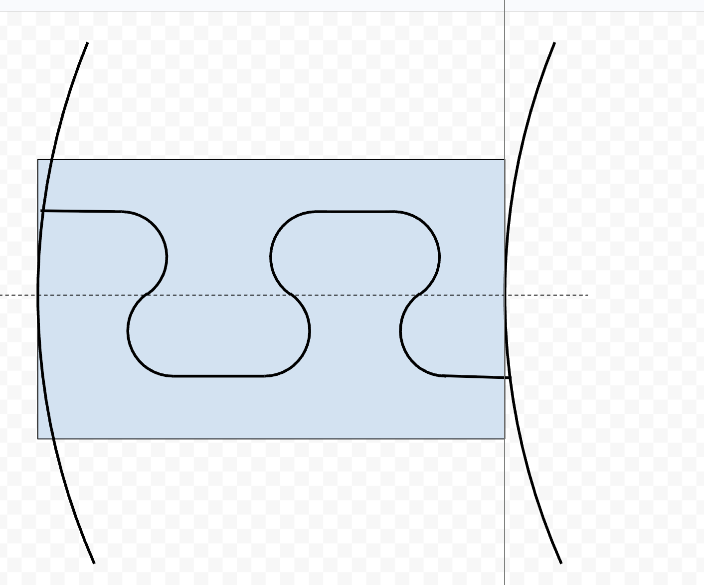

# cyl26 — Cylindrical Magnet Ring

PETG sleeve that mounts on an existing 4-inch cast iron shaft and holds 26 NdFeB N52 magnets (20 × 10 × 5 mm) on its outer surface.

## Assembly

The ring is printed as **two identical halves**.  The second half is the same print, flipped 180° around the shaft axis (Z).  The seam is at θ = 0° / 180°.

## Seam Joint

Each half has an **S-curve tongue** on one tangential end and a matching **S-curve groove** on the other.  When the two halves are placed around the shaft the tongue of each half slides axially (Z) into the groove of the other.

The S-profile is two tangent circular arcs (radius ≈ 0.45 mm) that create a smooth interlocking shape with no sharp corners.  Both features fit within the ~3 mm tangential gap between adjacent magnet pockets and span the full 5 mm radial wall thickness.



*Dashed line = Y = 0 seam plane.  Blue box = ~3 mm × 5 mm available area between magnet pockets.
Left feature = groove (pocket cut into body).  Right feature = tongue (protrudes past seam).*

## Key dimensions (from `config.json`)

| Parameter | Value |
|-----------|-------|
| Shaft OD (reference) | 101.6 mm |
| Bore clearance | 0.3 mm |
| Wall thickness | 5.0 mm |
| Sleeve length | 30.0 mm |
| Joint arc radius | 0.45 mm |
| Joint clearance (sliding fit) | 0.15 mm |

## Files

| File | Purpose |
|------|---------|
| `config.json` | All geometry parameters |
| `generate.py` | build123d model + OCP Viewer entry point |
| `sketch_joint_profile.png` | Hand sketch of S-joint cross-section |

## Running

```bash
.venv/bin/python cyl26/generate.py
```
