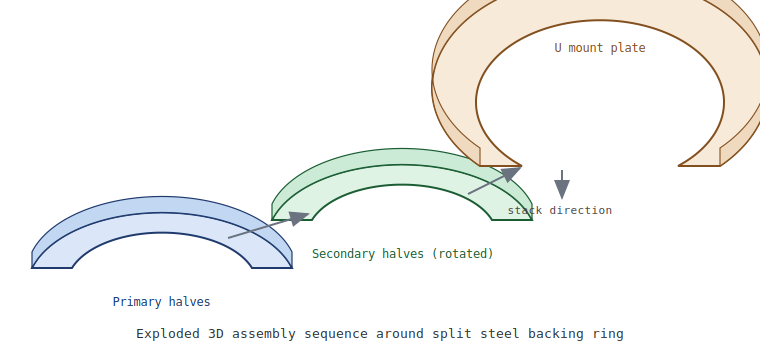

# Assembly (Exploded 3D View)

The multipart ring is assembled in three stacked stages:

1. **Primary half rings** mount to the split steel backing ring.
2. **Secondary half rings** rotate 90° and bridge the primary split seam.
3. **U-shaped mount plate** sits above and provides set/lock screw alignment features.

