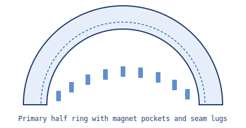
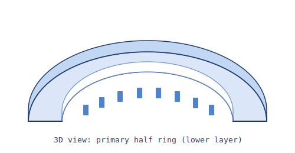

# Primary Half Ring

This part is one of the two lower halves that bolt to the split steel backing ring.

- 180° segment minus a small assembly gap at each split
- Includes magnet pockets (5 mm tangential width, 90 total around full ring)
- Adds seam lugs for bridge support near each cut end

