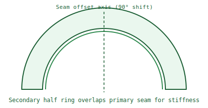

# Secondary Half Ring

This part is one of two upper halves that overlap the lower split line and lock the ring into a stable assembly.

- 180° segment rotated 90° from the lower-ring seam
- Reduced center material to keep mass lower
- Bridges the primary split so the final ring behaves as one structure

