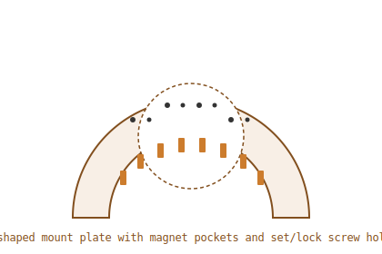

# U-Shaped Magnet Mount Plate

This is the face plate around the gudgeon for mounting and alignment.

- U-shaped arc plate with at least a 4" open center hole
- Contains magnet pockets on the plate face
- Includes paired set-screw + lock-screw hole pattern for alignment to axle centerline

